# 🏗️ DESIGN-RITE TOPOLOGY - MERMAID DIAGRAMS
**Analysis Date:** October 10, 2025
**Format:** Mermaid.js - Render in GitHub, VS Code, or https://mermaid.live

---

## 🌐 **HIGH-LEVEL ARCHITECTURE**

```mermaid
graph TB
    subgraph "User Layer"
        U[👤 User Browser]
    end

    subgraph "Core Platforms"
        MP[🏢 Main Platform v4<br/>Port 3000<br/>93 API Endpoints<br/>95% Ready]
        SP[🎯 Subscriber Portal<br/>portal.design-rite.com<br/>8 Features<br/>100% Ready]
    end

    subgraph "Microservices Layer"
        CS[✍️ Creative Studio<br/>Port 3030<br/>7 Endpoints<br/>Production Ready]
        SA[🧠 Super Agent<br/>Port 9500<br/>12 Tools<br/>Production Ready]
        SS[📐 Spatial Studio<br/>Port 3020<br/>22/22 Tests<br/>Production Ready]
        IS[🔍 Insight Studio<br/>Port 8000/8002<br/>12 Endpoints<br/>85% Ready]
        TS[🧪 Testing Service<br/>Port 9600<br/>15 Endpoints<br/>Production Ready]
    end

    subgraph "Data Layer"
        DB[(📦 Supabase<br/>PostgreSQL<br/>50+ Tables)]
        ST[📁 Supabase Storage<br/>spatial-floorplans<br/>creative-assets]
    end

    subgraph "External Services"
        AI1[🤖 Anthropic<br/>Claude 3.5 Sonnet<br/>Primary]
        AI2[🤖 OpenAI<br/>GPT-4/Vision<br/>Secondary]
        AI3[🤖 Google<br/>Gemini<br/>Tertiary]
        STRIPE[💳 Stripe<br/>Subscriptions<br/>80% Ready]
        CAL[📅 Calendly<br/>Demo Booking<br/>100% Ready]
    end

    U -->|HTTPS| MP
    U -->|HTTPS| SP
    MP <-->|Cross-Domain Auth| SP
    MP --> DB
    SP --> DB
    MP --> ST

    MP -.->|Future Proxy| CS
    MP -.->|Future Proxy| SA
    MP -->|Integrated| SS
    MP -.->|Future Proxy| IS
    MP -.->|Proxy| TS

    CS --> DB
    SA --> DB
    SS --> DB
    IS --> DB
    TS --> DB

    MP -->|Multi-AI Failover| AI1
    MP -->|Failover| AI2
    MP -->|Failover| AI3
    SS -->|GPT-4 Vision| AI2
    CS -->|Assistants API| AI2
    SA -->|Orchestration| AI1

    MP --> STRIPE
    MP --> CAL

    style MP fill:#9333ea,stroke:#7e22ce,stroke-width:3px,color:#fff
    style SP fill:#059669,stroke:#047857,stroke-width:3px,color:#fff
    style CS fill:#0891b2,stroke:#0e7490,stroke-width:2px,color:#fff
    style SA fill:#8b5cf6,stroke:#7c3aed,stroke-width:2px,color:#fff
    style SS fill:#0284c7,stroke:#0369a1,stroke-width:2px,color:#fff
    style IS fill:#ea580c,stroke:#c2410c,stroke-width:2px,color:#fff
    style TS fill:#dc2626,stroke:#b91c1c,stroke-width:2px,color:#fff
```

---

## 🔗 **SERVICE INTEGRATION FLOW**

```mermaid
graph LR
    subgraph "User Request Flow"
        REQ[User Request]
    end

    subgraph "Main Platform Processing"
        AUTH[🔐 Supabase Auth]
        AI_ENGINE[🤖 Multi-AI Engine<br/>Claude→OpenAI→Gemini]
        RATE[⚡ Rate Limiter<br/>LRU Cache]
        API[📡 API Routes<br/>93 Endpoints]
    end

    subgraph "Backend Services"
        SUPA[(Supabase<br/>Database)]
        STORAGE[Supabase<br/>Storage]
        STRIPE_API[Stripe API]
        CAL_API[Calendly API]
    end

    subgraph "AI Providers"
        CLAUDE[Claude 3.5]
        GPT4[GPT-4]
        GEMINI[Gemini]
    end

    REQ --> RATE
    RATE --> AUTH
    AUTH --> API
    API --> AI_ENGINE
    AI_ENGINE --> CLAUDE
    AI_ENGINE -.->|Failover| GPT4
    AI_ENGINE -.->|Failover| GEMINI
    API --> SUPA
    API --> STORAGE
    API --> STRIPE_API
    API --> CAL_API

    style REQ fill:#60a5fa,stroke:#3b82f6,stroke-width:2px
    style AI_ENGINE fill:#a78bfa,stroke:#8b5cf6,stroke-width:2px
    style CLAUDE fill:#f97316,stroke:#ea580c,stroke-width:2px
```

---

## 📊 **API ENDPOINT BREAKDOWN**

```mermaid
graph TD
    MP[Main Platform<br/>93 Endpoints]

    MP --> AUTH_API[🔐 Auth & User<br/>8 endpoints]
    MP --> AI_API[🤖 AI Discovery<br/>12 endpoints]
    MP --> QUOTE_API[💰 Quotes & Proposals<br/>10 endpoints]
    MP --> SCENARIO_API[📋 Scenarios<br/>5 endpoints]
    MP --> SURVEYOR_API[📊 System Surveyor<br/>5 endpoints]
    MP --> PRODUCT_API[🛍️ Products<br/>6 endpoints]
    MP --> PROVIDER_API[⚙️ AI Providers<br/>8 endpoints]
    MP --> STRIPE_API[💳 Stripe<br/>8 endpoints]
    MP --> DEMO_API[📅 Demo Booking<br/>4 endpoints]
    MP --> SPATIAL_API[📐 Spatial Studio<br/>7 endpoints]
    MP --> CREATIVE_API[✍️ Creative Studio<br/>7 endpoints<br/>NOT BUILT ❌]
    MP --> ADMIN_API[👨‍💼 Admin<br/>13 endpoints]

    style MP fill:#9333ea,stroke:#7e22ce,stroke-width:3px,color:#fff
    style AUTH_API fill:#059669,stroke:#047857,stroke-width:2px,color:#fff
    style AI_API fill:#0891b2,stroke:#0e7490,stroke-width:2px,color:#fff
    style QUOTE_API fill:#8b5cf6,stroke:#7c3aed,stroke-width:2px,color:#fff
    style CREATIVE_API fill:#dc2626,stroke:#b91c1c,stroke-width:2px,color:#fff
```

---

## 🔄 **CROSS-DOMAIN AUTHENTICATION FLOW**

```mermaid
sequenceDiagram
    participant U as 👤 User
    participant MP as Main Platform<br/>design-rite.com
    participant SP as Subscriber Portal<br/>portal.design-rite.com
    participant SB as Supabase Auth

    U->>MP: 1. Clicks "Sign In"
    MP->>SP: 2. Redirect to portal/auth
    U->>SP: 3. Enter credentials
    SP->>SB: 4. Authenticate
    SB-->>SP: 5. JWT Token
    SP->>SP: 6. Create session
    SP->>MP: 7. Redirect with #session={token}
    MP->>MP: 8. Read hash, decode token
    MP->>SB: 9. Validate token
    SB-->>MP: 10. User data
    MP->>MP: 11. Set local session
    MP-->>U: 12. Authenticated ✅

    Note over U,SB: User can now access<br/>both platforms seamlessly
```

---

## 🧠 **SUPER AGENT ORCHESTRATION**

```mermaid
graph TB
    USER[👤 User Natural<br/>Language Request]

    subgraph "Super Agent (Port 9500)"
        SA[🧠 Claude 3.5 Sonnet<br/>Orchestrator]
        TOOLS[12 Available Tools]
    end

    subgraph "MCP Server Tools"
        T1[scrape_static_page]
        T2[scrape_dynamic_page]
        T3[analyze_competitor_page]
        T4[monitor_page_changes]
    end

    subgraph "Intelligence Tools"
        T5[get_product_pricing]
        T6[transcribe_video]
        T7[search_competitor_intel]
    end

    subgraph "Spatial Tools"
        T8[analyze_floor_plan]
    end

    subgraph "Creative Tools"
        T9[generate_blog_post]
        T10[generate_case_study]
    end

    subgraph "Estimator Tools"
        T11[generate_security_proposal]
        T12[compare_specifications]
    end

    USER --> SA
    SA --> TOOLS
    TOOLS --> T1 & T2 & T3 & T4
    TOOLS --> T5 & T6 & T7
    TOOLS --> T8
    TOOLS --> T9 & T10
    TOOLS --> T11 & T12

    SA -->|Logs to| DB[(Supabase<br/>orchestration_tracking)]

    style SA fill:#8b5cf6,stroke:#7c3aed,stroke-width:3px,color:#fff
    style TOOLS fill:#a78bfa,stroke:#8b5cf6,stroke-width:2px,color:#fff
```

---

## 📐 **SPATIAL STUDIO ASYNC WORKFLOW**

```mermaid
sequenceDiagram
    participant U as 👤 User
    participant UI as Upload UI
    participant API as Upload API
    participant STORAGE as Supabase<br/>Storage
    participant DB as Database
    participant WORKER as Background<br/>Worker
    participant VISION as GPT-4 Vision

    U->>UI: 1. Upload floor plan (PDF/PNG)
    UI->>API: 2. POST /upload-floorplan
    API->>API: 3. Validate (10MB, type)
    API->>STORAGE: 4. Upload to bucket
    STORAGE-->>API: 5. File URL
    API->>DB: 6. Create project (status=pending)
    API->>WORKER: 7. Trigger async analysis
    API-->>UI: 8. Return projectId (2s response)

    Note over UI,WORKER: User sees "Processing..." UI<br/>Polls every 2 seconds

    WORKER->>DB: 9. Update status=processing
    WORKER->>STORAGE: 10. Download floor plan
    WORKER->>WORKER: 11. Convert to base64
    WORKER->>VISION: 12. Analyze with GPT-4 Vision
    VISION-->>WORKER: 13. Wall/door/window data
    WORKER->>WORKER: 14. Generate 3D model
    WORKER->>DB: 15. Update project (status=completed)

    UI->>API: 16. Poll: GET /upload-floorplan?projectId=xxx
    API->>DB: 17. Check status
    DB-->>API: 18. status=completed
    API-->>UI: 19. Return results + 3D model
    UI-->>U: 20. Display 3D visualization ✅
```

---

## 💳 **STRIPE SUBSCRIPTION FLOW**

```mermaid
graph LR
    subgraph "User Journey"
        U[👤 User Selects Plan]
        CHECKOUT[Checkout Page]
        SUCCESS[Success Page]
    end

    subgraph "Main Platform"
        CREATE[POST /stripe/create-checkout]
        WEBHOOK[POST /stripe/webhook]
        UPDATE[Update Subscription Status]
    end

    subgraph "Stripe"
        SESSION[Checkout Session]
        EVENT[Webhook Event]
    end

    subgraph "Database"
        DB[(Update user<br/>subscription_status)]
    end

    U --> CHECKOUT
    CHECKOUT --> CREATE
    CREATE --> SESSION
    SESSION -.->|User completes| SUCCESS
    SESSION --> EVENT
    EVENT --> WEBHOOK
    WEBHOOK --> UPDATE
    UPDATE --> DB

    style CREATE fill:#0891b2,stroke:#0e7490,stroke-width:2px,color:#fff
    style WEBHOOK fill:#8b5cf6,stroke:#7c3aed,stroke-width:2px,color:#fff
```

---

## 🚀 **DEPLOYMENT ARCHITECTURE**

```mermaid
graph TB
    subgraph "Production URLs"
        MAIN[🌐 design-rite.com<br/>Main Platform]
        PORTAL[🌐 portal.design-rite.com<br/>Subscriber Portal]
        CREATIVE[🌐 creative.design-rite.com<br/>Creative Studio<br/>TBD]
    end

    subgraph "Render.com Deployments"
        R1[Web Service 1<br/>Main Platform<br/>Auto-deploy: main branch]
        R2[Web Service 2<br/>Subscriber Portal<br/>Auto-deploy: main branch<br/>✅ LIVE]
        R3[Web Service 3<br/>Creative Studio<br/>TBD]
    end

    subgraph "Internal Services"
        INT1[Port 9500<br/>Super Agent<br/>Internal Only]
        INT2[Port 8000/8002<br/>Insight Studio<br/>Internal Only]
        INT3[Port 9600<br/>Testing Service<br/>Internal Only]
    end

    subgraph "Shared Infrastructure"
        SB[(Supabase<br/>PostgreSQL)]
        ST[Supabase<br/>Storage]
        CDN[Cloudflare CDN<br/>via Render]
    end

    MAIN --> R1
    PORTAL --> R2
    CREATIVE -.-> R3

    R1 --> SB
    R2 --> SB
    R3 -.-> SB
    INT1 --> SB
    INT2 --> SB
    INT3 --> SB

    R1 --> ST
    R3 -.-> ST

    MAIN --> CDN
    PORTAL --> CDN

    style R1 fill:#9333ea,stroke:#7e22ce,stroke-width:3px,color:#fff
    style R2 fill:#059669,stroke:#047857,stroke-width:3px,color:#fff
    style R3 fill:#94a3b8,stroke:#64748b,stroke-width:2px,color:#fff
```

---

## 🔐 **SECURITY & AUTHENTICATION LAYERS**

```mermaid
graph TD
    subgraph "Request Flow"
        REQ[Incoming Request]
    end

    subgraph "Security Layers"
        L1[Layer 1: Rate Limiting<br/>IP-based, LRU Cache]
        L2[Layer 2: Authentication<br/>Supabase JWT Validation]
        L3[Layer 3: Authorization<br/>Role-Based Access Control]
        L4[Layer 4: Input Validation<br/>Sanitization & Type Checking]
    end

    subgraph "Role Hierarchy"
        SUPER[🔱 Super Admin<br/>Full Control]
        ADMIN[👨‍💼 Admin<br/>User Management]
        MANAGER[👔 Manager<br/>Unlimited Features]
        USER[👤 User<br/>Rate Limited]
        GUEST[👻 Guest<br/>Strict Limits]
    end

    subgraph "Protected Resources"
        API[API Routes]
        DB[(Database<br/>RLS Policies)]
        STORAGE[File Storage<br/>Signed URLs]
    end

    REQ --> L1
    L1 -->|Pass| L2
    L1 -.->|Fail| REJECT1[429 Too Many Requests]
    L2 -->|Pass| L3
    L2 -.->|Fail| REJECT2[401 Unauthorized]
    L3 -->|Pass| L4
    L3 -.->|Fail| REJECT3[403 Forbidden]
    L4 -->|Pass| API
    L4 -.->|Fail| REJECT4[400 Bad Request]

    L3 --> SUPER & ADMIN & MANAGER & USER & GUEST

    API --> DB
    API --> STORAGE

    style L1 fill:#ef4444,stroke:#dc2626,stroke-width:2px,color:#fff
    style L2 fill:#f59e0b,stroke:#d97706,stroke-width:2px,color:#fff
    style L3 fill:#10b981,stroke:#059669,stroke-width:2px,color:#fff
    style L4 fill:#3b82f6,stroke:#2563eb,stroke-width:2px,color:#fff
```

---

## 📅 **CALENDLY DEMO BOOKING FLOW**

```mermaid
sequenceDiagram
    participant USER as 👤 Prospect
    participant CAL as Calendly
    participant WEBHOOK as Webhook Handler<br/>/api/webhooks/calendly
    participant SCORE as Lead Scoring<br/>Algorithm
    participant DB as Database<br/>demo_bookings
    participant DASH as Admin Dashboard<br/>/admin/demo-dashboard

    USER->>CAL: 1. Books demo
    USER->>CAL: 2. Fills custom questions<br/>(challenge, volume, urgency)
    CAL->>WEBHOOK: 3. invitee.created event
    WEBHOOK->>SCORE: 4. Calculate lead score (0-100)
    SCORE->>SCORE: 5. Analyze responses<br/>• Challenge keywords: +15-25<br/>• Volume tier: +10-25<br/>• Urgency: +15-25
    SCORE-->>WEBHOOK: 6. Final score + high_value flag
    WEBHOOK->>DB: 7. Store booking + score
    DB-->>WEBHOOK: 8. Confirm saved
    WEBHOOK-->>CAL: 9. 200 OK

    Note over DASH: Admin can now see<br/>high-value leads (score ≥ 70)

    DASH->>DB: 10. GET upcoming demos
    DB-->>DASH: 11. Return sorted by score
    DASH->>DASH: 12. Highlight high-value leads
```

---

## 🧪 **TESTING SERVICE WORKFLOW**

```mermaid
graph TB
    subgraph "User Actions"
        MANUAL[🖱️ Manual Test Run]
        SCHEDULE[⏰ Cron Schedule]
    end

    subgraph "Testing Service (Port 9600)"
        API[FastAPI Server]
        RUNNER[Test Runner<br/>Agent]
        SCHEDULER[APScheduler<br/>Cron Jobs]
        WS[WebSocket<br/>Live Updates]
        CHAT[AI Chat<br/>Assistant]
    end

    subgraph "Test Suites"
        STRESS[💪 Stress Tests<br/>Concurrent requests<br/>Large payloads]
        SEC[🛡️ Security Tests<br/>SQL injection<br/>XSS, CSRF]
        UX[👥 UX Tests<br/>User workflows<br/>Data population]
        ADMIN[👨‍💼 Admin Tests<br/>Permissions<br/>CRUD operations]
    end

    subgraph "Storage"
        DB[(Supabase<br/>test_runs<br/>test_results)]
        REPORTS[📊 Report Export<br/>PDF/CSV/JSON]
    end

    MANUAL --> API
    SCHEDULE --> SCHEDULER
    SCHEDULER --> API
    API --> RUNNER
    RUNNER --> STRESS & SEC & UX & ADMIN
    RUNNER -.->|Real-time| WS
    RUNNER --> DB
    DB --> REPORTS
    API --> CHAT

    style API fill:#dc2626,stroke:#b91c1c,stroke-width:2px,color:#fff
    style RUNNER fill:#ea580c,stroke:#c2410c,stroke-width:2px,color:#fff
    style WS fill:#8b5cf6,stroke:#7c3aed,stroke-width:2px,color:#fff
```

---

## 🔄 **MULTI-AI FAILOVER LOGIC**

```mermaid
flowchart TD
    START([User Request])
    LOAD[Load Enabled Providers<br/>Sort by Priority]

    TRY_CLAUDE{Try Claude 3.5<br/>Primary Provider}
    CLAUDE_SUCCESS[✅ Claude Response]
    CLAUDE_FAIL[❌ Claude Failed]

    TRY_OPENAI{Try OpenAI GPT-4<br/>Secondary Provider}
    OPENAI_SUCCESS[✅ OpenAI Response]
    OPENAI_FAIL[❌ OpenAI Failed]

    TRY_GEMINI{Try Google Gemini<br/>Tertiary Provider}
    GEMINI_SUCCESS[✅ Gemini Response]
    GEMINI_FAIL[❌ Gemini Failed]

    FALLBACK[🔄 Graceful Fallback<br/>Pre-defined Response]

    LOG[📝 Log to Supabase<br/>ai_sessions table]
    RETURN([Return to User])

    START --> LOAD
    LOAD --> TRY_CLAUDE
    TRY_CLAUDE -->|Success| CLAUDE_SUCCESS
    TRY_CLAUDE -->|Fail| CLAUDE_FAIL
    CLAUDE_FAIL --> TRY_OPENAI
    TRY_OPENAI -->|Success| OPENAI_SUCCESS
    TRY_OPENAI -->|Fail| OPENAI_FAIL
    OPENAI_FAIL --> TRY_GEMINI
    TRY_GEMINI -->|Success| GEMINI_SUCCESS
    TRY_GEMINI -->|Fail| GEMINI_FAIL
    GEMINI_FAIL --> FALLBACK

    CLAUDE_SUCCESS --> LOG
    OPENAI_SUCCESS --> LOG
    GEMINI_SUCCESS --> LOG
    FALLBACK --> LOG
    LOG --> RETURN

    style CLAUDE_SUCCESS fill:#10b981,stroke:#059669,stroke-width:2px,color:#fff
    style OPENAI_SUCCESS fill:#10b981,stroke:#059669,stroke-width:2px,color:#fff
    style GEMINI_SUCCESS fill:#10b981,stroke:#059669,stroke-width:2px,color:#fff
    style FALLBACK fill:#f59e0b,stroke:#d97706,stroke-width:2px,color:#fff
```

---

## 🎯 **LAUNCH DECISION TREE**

```mermaid
flowchart TD
    START([October 17<br/>Launch Decision])

    CORE{Launch Core<br/>Platform?}
    CORE -->|YES ✅| PLATFORM[Main Platform v4<br/>+ Subscriber Portal]
    CORE -->|NO| DELAY[Delay Launch]

    PLATFORM --> SPATIAL{Include Spatial<br/>Studio?}
    SPATIAL -->|V4 Integrated ✅| SPATIAL_V4[Use /admin/spatial-studio-dev<br/>Already in v4]
    SPATIAL -->|Standalone| SPATIAL_PORT[Deploy Port 3020<br/>22/22 tests passing]

    SPATIAL_V4 --> MICRO{Deploy<br/>Microservices?}

    MICRO -->|Select Few| SELECT[Testing Service ✅<br/>Creative Studio 📅<br/>Super Agent 📅]
    MICRO -->|All| ALL_MICRO[7 Services<br/>Complex Deployment]
    MICRO -->|None| CORE_ONLY[Core Only<br/>6 Hours Work]

    CORE_ONLY --> CHECKLIST[✅ Stripe Production<br/>✅ Rate Limiting<br/>✅ Smoke Tests]
    SELECT --> CHECKLIST
    ALL_MICRO --> DELAY

    CHECKLIST --> LAUNCH([🚀 GO LIVE!<br/>October 17])

    DELAY --> INTEGRATE[Full Integration<br/>30+ Hours]
    INTEGRATE -.->|Later| NOV_LAUNCH([Launch November])

    style PLATFORM fill:#9333ea,stroke:#7e22ce,stroke-width:3px,color:#fff
    style SPATIAL_V4 fill:#059669,stroke:#047857,stroke-width:2px,color:#fff
    style CORE_ONLY fill:#10b981,stroke:#059669,stroke-width:2px,color:#fff
    style LAUNCH fill:#0891b2,stroke:#0e7490,stroke-width:3px,color:#fff
```

---

## 📝 **HOW TO USE THESE DIAGRAMS**

### **View in GitHub:**
1. Push this file to GitHub
2. GitHub automatically renders Mermaid diagrams
3. View in repository or pull requests

### **View in VS Code:**
1. Install "Markdown Preview Mermaid Support" extension
2. Open this file
3. Click "Preview" (Ctrl+Shift+V)

### **View Online:**
1. Copy any diagram code block
2. Go to https://mermaid.live
3. Paste and view interactive diagram
4. Export as PNG/SVG

### **Edit Diagrams:**
```bash
# Each diagram starts with ```mermaid
# Edit the text-based definition
# Changes reflect automatically in preview
```

---

**Last Updated:** October 10, 2025
**Created By:** Claude Code
**Format:** Mermaid.js
**Status:** Ready for visualization ✅
